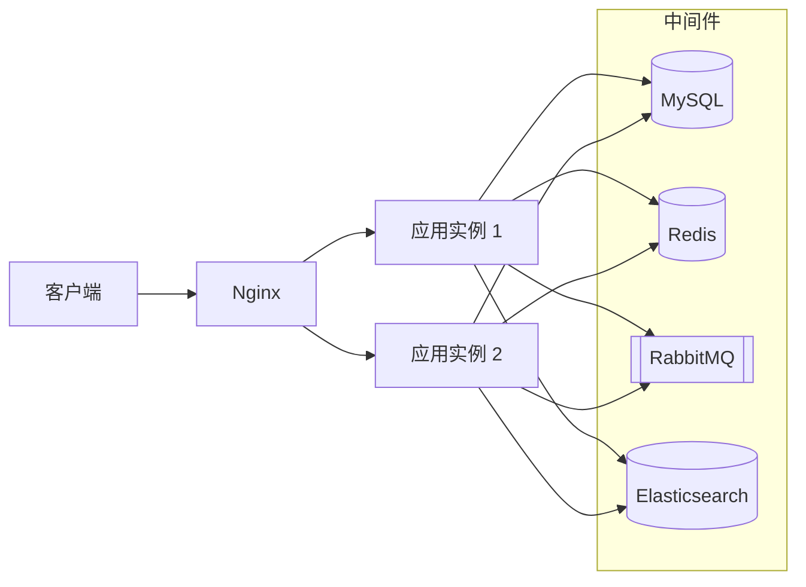
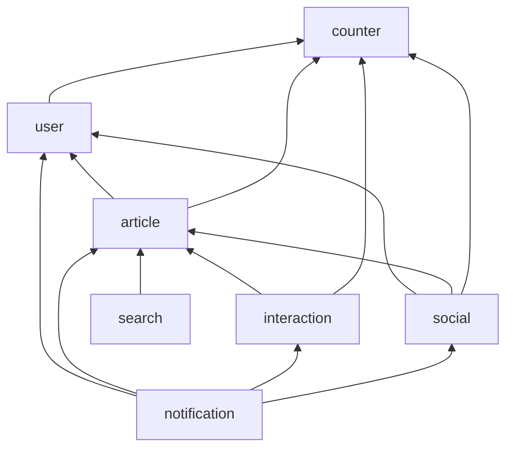
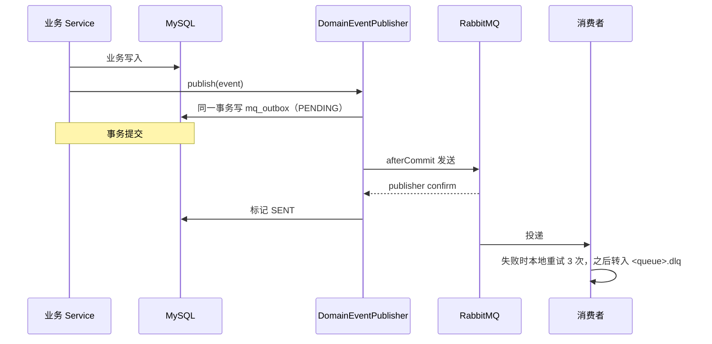
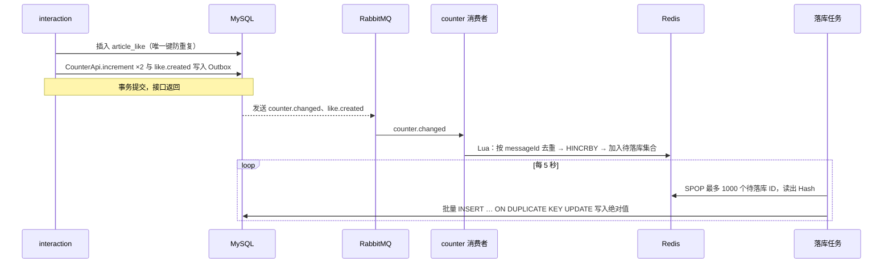
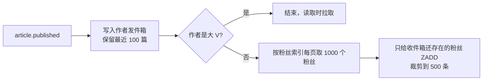
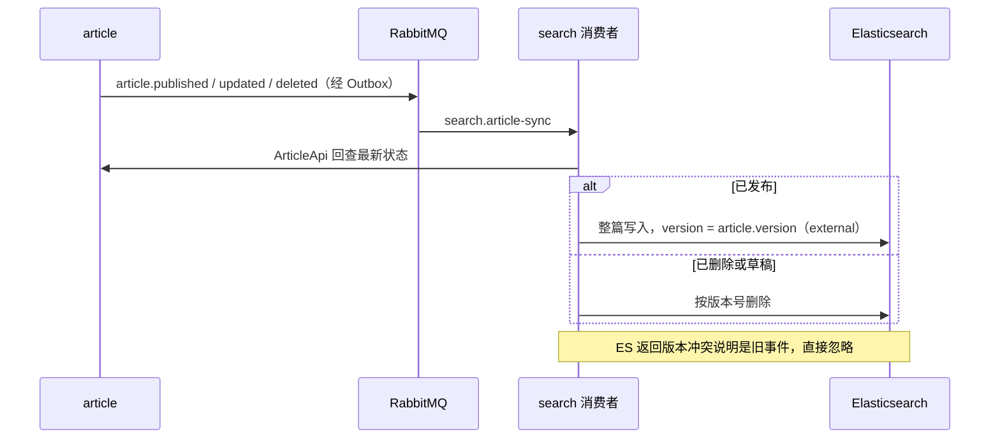
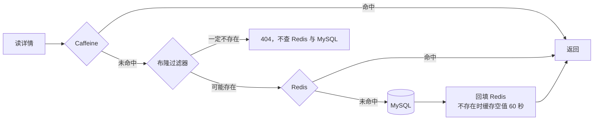

# 架构总览

本文说明码巢由哪些部分组成、模块之间怎样协作，以及几条关键链路的执行过程。各设计的取舍与参数以[项目规格](../.scratch/code-nest/spec.md)和其中链接的决策票为准；表、Redis key、队列与索引的清单见[存储与消息清单](data.md)，术语见 [CONTEXT.md](../CONTEXT.md)。

## 系统组成

应用是无状态的单体，可以部署多个实例；本地开发时只运行一个实例，不经过 Nginx。

| 组件 | 保存或承担的内容 |
|---|---|
| MySQL | 全部业务数据，是唯一的事实来源；另有 Outbox 表与消费记录表 |
| Redis | 计数的实时值、Feed 收件箱与发件箱、缓存与布隆过滤器、热榜、限流窗口、分布式锁、登录会话；本地缓存失效广播走 Pub/Sub |
| RabbitMQ | 模块之间的领域事件，一个 topic 交换机，每个消费队列带死信队列 |
| Elasticsearch | 已发布文章的全文索引，经别名访问 |

除 MySQL 外，其余数据都可以由 MySQL 重新生成：计数靠对账，布隆过滤器、Feed 发件箱与大 V 名单在启动时重建，收件箱在读者首次读取时重建，搜索索引可以全量重建。

每个实例另开管理端口 8081，提供健康检查、指标，以及手动触发计数对账（`POST /actuator/counter-reconcile`）和重建搜索索引（`POST /actuator/search-rebuild`）的端点。管理端口不经过登录鉴权，不能对外暴露。

## 模块与依赖

项目是 Maven 多模块的模块化单体。

| 模块 | 职责 |
|---|---|
| user | 注册、登录、个人资料、用户主页 |
| article | 文章、分类与标签、评论与回复、热榜，文章详情缓存与布隆过滤器 |
| interaction | 点赞、收藏 |
| social | 关注、关注 Feed |
| notification | 通知的生成与读取 |
| search | 文章同步到 ES、搜索、索引重建 |
| counter | 全部计数的存储、落库与对账，不依赖任何业务模块 |

业务模块都依赖 `code-nest-framework`（缓存、MQ、锁、限流、认证等基础设施）和 `code-nest-common`（返回体、错误码、分页结构）。`code-nest-app` 只放启动类、配置与集成测试。

模块之间的规则：

- 只能调用对方 `api` 包里的门面接口与 DTO，不联表。需要别的模块的数据时，由服务层批量调用对方的门面后组装。依赖单向无环，由 ArchUnit 测试检查（见 [ADR-0001](adr/0001-modular-monolith-api-package-seam.md)）。
- 同步的查询走门面；跨模块的异步副作用一律经 RabbitMQ 发送领域事件，事件类放在生产方的 `api/event/` 下。事件只带 ID 与少量常用字段，消费者需要最新数据时回查生产方的门面。
- counter 模块反向依赖业务数据的地方只有对账：各业务模块实现 `CounterSource`，由 counter 模块统一调度。

## 一个请求的处理过程

1. **认证**：Sa-Token 拦截器校验 `Authorization: Bearer <token>`，除标了 `@SaIgnore` 的公开接口外都要求登录。Controller 经 `AuthContext` 取当前用户 ID，作为参数传给 Service；业务代码不直接接触 Sa-Token。
2. **限流**：限流拦截器读取接口上的 `@RateLimit`，按用户 ID 或客户端 IP 检查滑动窗口，超限返回 429 和 `Retry-After`。规则在启动时解析并校验。
3. **业务处理**：Service 读写本模块的表，需要时调用其他模块的门面；写操作需要的副作用在同一个事务里经 `DomainEventPublisher` 发出事件。
4. **响应**：返回体统一为 `{code, message, data}`，业务异常由全局异常处理转换成对应的 HTTP 状态码与错误码。

## 关键链路

### 消息可靠投递

所有跨模块的事件都经过这条链路。

- 发送失败或没有收到 confirm 的记录保持 PENDING，由补发任务每 5 秒用 `SELECT … FOR UPDATE SKIP LOCKED` 扫描，按指数退避（10 秒起，最长 30 分钟）重发，累计失败 10 次标记为 FAILED 并打告警日志。多个实例不会重复处理同一行。
- 没有活跃事务时，事件直接发送，靠 confirm 加重试保证送达。
- 投递是"至少一次"，消费者自己保证幂等：会写 MySQL 的消费者标 `@IdempotentConsumer`，在业务事务里插入 `mq_consume_record` 唯一键；计数消费者在 Redis 的 Lua 脚本里按 messageId 去重；本身幂等的消费者（按外部版本号写 ES、增删 Redis 集合成员、删缓存）不加。
- 重试耗尽的消息留在死信队列，打告警日志，不自动重放。

### 点赞与计数

- 点赞关系在请求内同步写库；文章点赞数、作者获赞数这两行热点计数移出了请求事务，由 counter 模块异步累加，不再有行锁排队。
- Redis 里的计数 Hash 不存在时，Lua 返回 MISS，消费者从 MySQL 读出计数回填后重跑。
- 浏览量是近似计数，读详情时直接在 Redis 里累加并标记待落库，不经过 MQ，也不对账。
- 每周一 04:00 对账（也可以手动触发）：掌握关系数据的模块分页 `GROUP BY` 重新统计，counter 模块只修正不一致的对象。
- `like.created` 另由 notification 消费，给文章作者发通知。

### 发文与关注 Feed

**推送**（`social.feed-push` 消费 `article.published`）：

**读取**：

1. 从 MySQL 用覆盖索引查出我关注的作者。
2. 用一条 `ZRANGEBYSCORE` 从大 V 名单取出全部大 V，与关注列表求交集。
3. 读收件箱；不存在就用关注的普通作者的发件箱重建（冷用户回来时走这里）。
4. 拉取各大 V 的发件箱。
5. 按文章 ID 合并、去重、倒序取一页；文章 ID 本身就是游标。
6. 经 `ArticleApi.listPublishedItems` 组装列表项，滤掉已删除、非发布状态和已取关作者的文章。

**修正**（`social.feed-fix`）：关注时把对方的发件箱并入我的收件箱；取关时按对方的发件箱从我的收件箱移除；删文时从作者的发件箱移除。关注和取关还会按关注表重新统计对方的粉丝数：升为大 V 时已推送的文章留在收件箱，读取时去重；降为普通作者时，把他的发件箱并入全部粉丝已存在的收件箱。修正不到的残留由读取时的过滤兜底。

### 搜索同步与索引重建

- 每次都按最新状态写入，事件乱序、重复都不影响结果；外部版本号防止并发消费时旧数据覆盖新数据。
- 搜索只从 ES 取文章 ID 与高亮片段，作者、分类、计数等展示字段经 `ArticleApi` 批量补全，与 Feed、收藏列表是同一种列表项。
- **全量重建**：在 Redis 锁内新建下一版本索引 `article_v{n}` → 按 ID 游标每批 500 篇导入 → 原子切换别名 `article` → 按 `updated_at` 追补导入期间的变更 → 删除旧索引。搜索全程不中断。应用启动时如果别名不存在，自动执行一次。

### 文章详情读取与缓存失效

- 同一实例上对同一篇文章的并发未命中只加载一次（Caffeine 同 key 合并加载），防止热点 key 过期时击穿到数据库。
- 缓存里不放计数，计数每次从 counter 模块批量读取；点赞不会让文章缓存失效。
- **写后失效**：编辑、发布、删除提交后删除 Redis 中的详情与摘要，并经 Pub/Sub 频道通知各实例清除本地缓存；`article.cache-evict` 消费文章事件再删一次，MQ 的投递延迟起到延迟双删的作用。Pub/Sub 漏收时，本地缓存靠 60 秒过期兜底。
- 用户与文章的批量摘要（列表、通知等组装时使用）只缓存在 Redis，批量读取走 `MGET`。

## 定时任务与启动任务

| 任务 | 时机 | 多实例互斥 |
|---|---|---|
| Outbox 补发 | 每 5 秒 | `FOR UPDATE SKIP LOCKED` |
| 清理 7 天前已发送的 Outbox 记录 | 每小时整点 | 按批删除，重复执行无害 |
| 计数落库 | 每 5 秒 | `SPOP` 原子取出，各实例处理不同的对象 |
| 计数对账 | 每周一 04:00，或手动触发 | Redis 锁 |
| 热榜重算：最近 7 天发布的文章按热度取前 100，写入临时 key 后 `RENAME` 替换 | 每 5 分钟 | Redis 锁 |
| 重建布隆过滤器 | 启动时，过滤器或导入完成标记不存在 | 重复导入无害 |
| 重建 Feed 发件箱与大 V 名单 | 启动时，重建完成标记不存在 | 重复重建无害 |
| 建搜索索引 | 启动时，别名不存在 | Redis 锁，锁内再次检查别名 |

已知的一致性窗口与缺陷（计数落库窗口、对账误差、Cache-Aside 竞态、Pub/Sub 漏收、Feed 某页不足 size 条）见[压测报告](benchmark.md)的"已知缺陷"一节。
