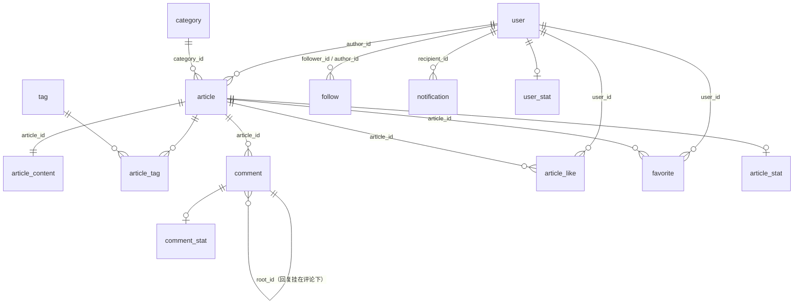

# 存储与消息清单

本文列出码巢在 MySQL、Redis、RabbitMQ、Elasticsearch 中保存的全部数据及其归属。各部分怎样协作见[架构总览](architecture.md)。

## MySQL

每个模块只读写自己的表，跨模块取数据经对方的门面，不联表，也不建物理外键。表结构由各模块资源目录下的 Flyway 脚本定义（`db/migration/<模块>/V<模块编号>_xxx__*.sql`），完整字段以脚本为准。

通用约定：

- 主键是雪花 ID；计数表例外，以业务对象的 ID 为主键。
- 全部表都有 `created_at`、`updated_at`。
- 只有内容类表（`article`、`comment`）有 `deleted` 字段，做软删除；关系类表（点赞、收藏、关注）取消时物理删除。

### 表之间的关系

下图的连线是逻辑关联，数据库里没有外键。

### 表清单

| 模块 | 表 | 用途 | 索引与约束 |
|---|---|---|---|
| user | `user` | 用户与资料，密码存 BCrypt 哈希 | `uk_username`：用户名全站唯一 |
| article | `category`、`tag` | 系统预置的分类与标签，由 Flyway 写入，ID 是固定的小整数 | 名称唯一 |
| article | `article` | 文章元数据；`status` 区分草稿与已发布，`version` 是乐观锁，同时作为 ES 外部版本号 | `(author_id, status, published_at)`：作者文章、草稿；`(category_id, status, published_at)`：按分类浏览；`(status, published_at)`：首页最新文章 |
| article | `article_content` | Markdown 正文，与 `article` 垂直拆分，列表查询不读正文 | 主键 `article_id` |
| article | `article_tag` | 文章与标签的关联，每篇至多 5 个 | 主键 `(article_id, tag_id)`；`(tag_id, article_id)`：按标签浏览 |
| article | `comment` | 评论与回复：`root_id = 0` 是评论，否则是挂在该评论下的回复，回复可带 `reply_to_user_id` | `(article_id, root_id, id)`：文章的评论列表、评论的回复列表按 ID 翻页；`(root_id)`：对账统计回复数 |
| interaction | `article_like` | 点赞，另存被点赞文章的 `author_id` 供对账统计获赞数 | `uk_user_article`：每人每篇至多一次；`(article_id)`、`(author_id)`：对账 |
| interaction | `favorite` | 收藏 | `uk_user_article`；`(user_id, id)`：我的收藏翻页；`(article_id)`：对账 |
| social | `follow` | 关注关系 | `uk_follower_author`；`(author_id, follower_id)`：推送时按粉丝分页；`(author_id, id)`、`(follower_id, id)`：粉丝列表、关注列表翻页 |
| notification | `notification` | 通知，只存 ID，展示信息读取时组装；`type` 为点赞、评论、回复、关注 | `uk_dedup_key`：点赞、关注同一动作只通知一次（评论、回复为 NULL，不去重）；`(recipient_id, id)`：通知列表；`(recipient_id, is_read)`：未读数 |
| counter | `article_stat`、`user_stat`、`comment_stat` | 计数的持久副本，由落库任务写入绝对值；没有行时按全 0 处理 | 主键是业务对象 ID |
| framework | `mq_outbox` | 本地消息表，与业务数据同一事务写入；ID 兼作 messageId | `(status, next_retry_at)`：补发扫描；`(status, created_at)`：清理 |
| framework | `mq_consume_record` | 消费记录，`@IdempotentConsumer` 的去重依据 | `uk_message_consumer (message_id, consumer)` |

## Redis

除登录会话外，下表是应用写入的全部 key。"可重建"指数据丢失后系统能自行恢复。

| key | 类型 | 过期 | 内容 | 读写方 | 丢失后 |
|---|---|---|---|---|---|
| `counter:{article\|user\|comment}:{id}` | Hash | 不过期 | 一个对象的全部计数，字段如 `like`、`favorite`、`comment`、`view`、`follower`、`following`、`article`、`like_received`、`reply` | counter | 读取或累加时从计数表回填；未落库的增量由对账补回 |
| `counter:dirty:{article\|user\|comment}` | Set | 不过期 | 待落库的对象 ID | counter | 未落库的增量由对账补回 |
| `counter:dedup:{messageId}` | String | 24 小时 | 计数消息的去重标记 | counter | 丢失期间重复投递的消息可能重复计数，由对账修正 |
| `counter:reconcile:lock` | String | 1 小时 | 对账互斥锁 | counter | — |
| `feed:inbox:{userId}` | ZSet | 7 天，读取时续期 | 读者的收件箱，member 与 score 都是文章 ID，最多 500 条 | social | 读者下次读取时从发件箱重建 |
| `feed:outbox:{authorId}` | ZSet | 不过期 | 作者最近发布的 100 篇文章 | social | 启动时重建 |
| `feed:outbox:ready` | String | 不过期 | 发件箱重建完成标记 | social | 启动时重建全部发件箱 |
| `feed:followers` | ZSet | 不过期 | 作者 ID → 粉丝数，用来识别大 V | social | 启动时重建 |
| `feed:followers:ready` | String | 不过期 | 粉丝数重建完成标记 | social | 启动时重建 |
| `cache:article:detail:{id}` | String（JSON） | 30 分钟加 0–5 分钟抖动；空值 60 秒 | 文章详情（元数据加正文，不含计数），另有 Caffeine 本地缓存 | article | 回源 MySQL |
| `cache:article:brief:{id}` | String（JSON） | 同上 | 文章摘要，列表组装用 | article | 回源 MySQL |
| `cache:user:brief:{id}` | String（JSON） | 同上 | 用户摘要（昵称、头像） | user | 回源 MySQL |
| `bf:article` | Bloom filter | 不过期 | 全部文章 ID，文章创建时加入 | article | 标记缺失期间全部视为可能存在；启动时重建 |
| `bf:article:ready` | String | 不过期 | 布隆过滤器导入完成标记 | article | 同上 |
| `hot:articles` | ZSet | 不过期 | 热榜前 100 名，member 是文章 ID，score 是热度 | article | 下一次重算（5 分钟内）恢复 |
| `hot:articles:tmp` | ZSet | — | 重算时的临时榜单，写完 `RENAME` 为正式榜单 | article | — |
| `hot:lock` | String | 240 秒 | 热榜重算互斥锁 | article | — |
| `search:article:rebuild:lock` | String | 1 小时 | 搜索索引重建互斥锁 | search | — |
| `rate-limit:{额度名}:{user:<id>\|ip:<地址>}` | ZSet | 窗口长度 | 滑动窗口内的请求时间戳 | framework | 限流窗口清零 |
| `Authorization:login:*` | — | 7 天 | 登录会话，由 Sa-Token 管理，前缀取自配置 `sa-token.token-name` | framework | 已登录用户需要重新登录 |

另有 Pub/Sub 频道 `cache:invalidate`：消息内容是被删除的缓存 key，各实例收到后清除对应的本地缓存。

## RabbitMQ

只有一个 topic 交换机 `codenest.events`，路由键格式是 `<生产模块>.<事件>`。消息的 `message_id` 属性是 messageId（即 Outbox 记录的 ID），`type` 属性是事件类型，body 是事件的 JSON。交换机与队列都持久化，队列是 classic 类型。

### 事件

| 路由键 | 生产方 | 字段 | 触发时机 |
|---|---|---|---|
| `article.published` | article | articleId、authorId | 草稿发布 |
| `article.updated` | article | articleId、authorId | 编辑文章 |
| `article.deleted` | article | articleId、authorId | 删除文章 |
| `comment.created` | article | commentId、articleId、userId、rootId、replyToUserId、articleAuthorId | 发表评论或回复 |
| `like.created` | interaction | articleId、userId、authorId | 新增点赞（重复点赞不发） |
| `follow.created` | social | followerId、authorId | 新增关注 |
| `follow.deleted` | social | followerId、authorId | 取关 |
| `counter.changed` | counter | metric、targetId、delta | 业务模块调用 `CounterApi.increment`（浏览量除外）；只由 counter 模块自己消费 |

### 队列

| 队列 | 订阅的路由键 | 消费方与用途 | 幂等方式 |
|---|---|---|---|
| `counter.update` | `counter.changed` | counter：在 Redis 里累加计数 | Lua 脚本按 messageId 去重 |
| `social.feed-push` | `article.published` | social：写发件箱，推送到粉丝收件箱 | ZSet 写入本身幂等 |
| `social.feed-fix` | `follow.created`、`follow.deleted`、`article.deleted` | social：关注并入、取关移除、删文移出发件箱，更新粉丝数 | 集合操作本身幂等，粉丝数按关注表重新统计 |
| `search.article-sync` | `article.published`、`article.updated`、`article.deleted` | search：回查最新状态写入或删除 ES | ES 外部版本号 |
| `article.cache-evict` | `article.updated`、`article.deleted` | article：第二次删除文章缓存 | 删除本身幂等 |
| `notification.create` | `like.created`、`comment.created`、`follow.created` | notification：生成通知 | `@IdempotentConsumer`，另有 `dedup_key` |

每个队列都有对应的死信队列 `<队列名>.dlq`，经死信交换机 `codenest.dlx` 路由。消费失败先在本地重试 3 次（间隔 1、2、4 秒），仍失败就转入死信队列，不自动重放。

## Elasticsearch

业务代码只经别名 `article` 访问，真实索引名是 `article_v{n}`，全量重建时递增。mapping 定义在 search 模块的 `search/article-index.json`，`dynamic: strict`，1 个分片、0 个副本。

| 字段 | 类型 | 说明 |
|---|---|---|
| `id` | long | 文章 ID，同时是文档 ID |
| `title`、`summary`、`content` | text | 写入用 `ik_max_word`，查询用 `ik_smart`；`content` 是 Markdown 原文 |
| `tags` | keyword（小写归一） | 标签名，关键词与标签名一致时加分 |
| `tagIds`、`categoryId`、`authorId` | keyword | 筛选条件 |
| `publishedAt` | date | 按最新排序 |

- 只索引已发布的文章。文档版本号是 `article.version`（`version_type=external`），ES 只接受比已有版本更大的写入与删除。
- 作者昵称、分类名和计数不进 ES，展示时经 `ArticleApi` 补全。
